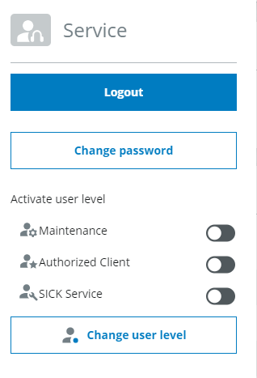
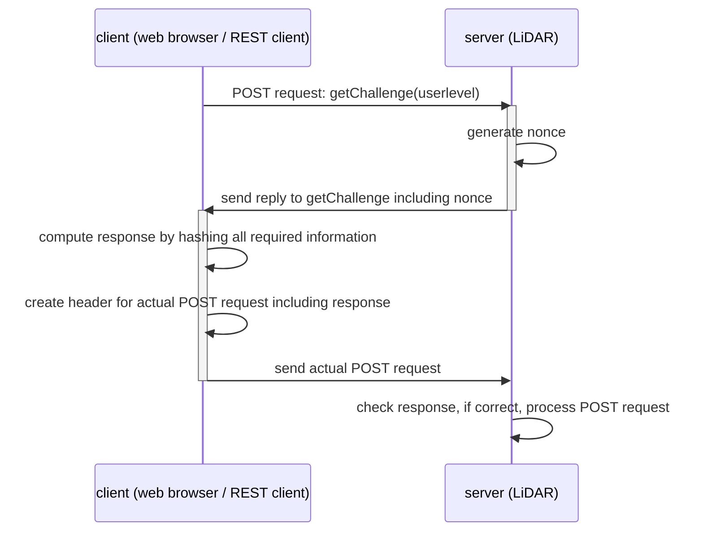

# SICK Scan REST Client

The SICK Scan REST Client shows how to read and write variables and how to call methods via the REST interface of the sensor. Variables are read using GET requests. To write variables and to call methods POST requests are required which can be challenging as the device uses a challenge-response authentication method.

The scripts are not intended to be used in productive code.

# User levels
The LIDAR device works with different user levels (Maintenance, Authorized Client and Service). By default only user level Service is enabled. If communication via other user levels is desired, they need to be enabled first, e.g. via the UI.




# Challenge-response authentication method
For sending POST requests to the LIDAR challenge-response authentication is required.

The challenge-response authentication is a security mechanism that involves the exchange of a challenge and a response between a client and a server. The server (LIDAR) sends a challenge to the client, which the client must respond to with a valid response. The different steps which are required to execute a POST request to write a variable or to call a method are (the code snippets below correspond directly to the variable names in the code):
1. The client calls the method `getChallenge` of the LIDAR with a POST request. (No authentication is required for the POST request to call that method.) As payload the username for the actual POST request (which requires authentication) is sent.
2. In the method `getChallenge` the LIDAR generates a random number called nonce.
3. The LIDAR sends the reply to the `getChallenge` request which contains (among other fields) also the nonce (`chal['challenge']['nonce']`)
4. The client combines the nonce with the username, the password for that username and also the method or variable name for the actual POST request and encrypts all that information using the SHA256 hash function.
Some LIDARs also send a salt (contained in `chal['challenge']['salt']`) which is a random number that is appended to the password before it is put in the hash function to make it more difficult for a potential attacker to recover the password from the hash value.
5. The client generates a request header which contains the response computed in the previous step (`header['response']`) as well as the desired username (`header['user']`) and the fields nonce, opaque and realm from the challenge.
6. This header (field `requestDict['header']`) is now used in the actual POST request which is sent from the client to the LIDAR. The payload of the request (field `requestDict['data']`) contains the name of the method to be called or the variable to be written as well as the parameters.

Note that the nonce, i.e. random number which is sent from the LIDAR to the client, changes for every request to prevent a potential attacker to use it to find out the secret password. That means that for each POST request the challenge has to be computed again as described above.

The sequence diagram below shows the information exchange between the client and the LIDAR sensor.



### Rate Limiting
Some LIDAR devices have a rate limiting on REST endpoints. That means that the LIDAR does not respond to further requests if there are too many requests in a certain time period, until some time has passed. If you encounter this, slow down the rate at which you access REST endpoints of the LIDAR.


## Installation
Poetry is required to install the SICK Scan REST Client. See https://python-poetry.org/docs/ for installation instructions. With poetry installed simple type ```poetry install``` in the directory where the ```pyproject.toml``` file is located. Now the package can be used from the created virtual environment.

## Usage
See ```examples/sick_scan_rest_client_example.py``` for a usage example.

Run the example with ```poetry run python .\examples\sick_scan_rest_client_example.py```

## Further reading
A list with available variables and methods which can be addressed via the REST-Interface can be found as openAPI description here:

picoScan150: https://www.sick.com/de/en/catalog/digital-services-and-solutions/sick/rest-api-description-picoscan150-openapi-file/p/p678507?tab=downloads

multiScan136: https://www.sick.com/de/en/catalog/digital-services-and-solutions/sick/rest-api-description-multiscan136-openapi-file/p/p678669?tab=downloads

## Dependencies

This module relies on the following dependencies which are downloaded during the build process.

| Name               | Version  | License-Classifier                   | URL                                                      |
|--------------------|----------|--------------------------------------|----------------------------------------------------------|
| certifi            | 2024.2.2 | Mozilla Public License 2.0 (MPL 2.0) | https://github.com/certifi/python-certifi                |
| charset-normalizer | 3.3.2    | MIT License                          | https://github.com/Ousret/charset_normalizer             |
| idna               | 3.6      | BSD License                          | https://github.com/kjd/idna                              |
| requests           | 2.31.0   | Apache Software License              | https://requests.readthedocs.io                          |
| urllib3            | 2.0.7    | MIT License                          | https://github.com/urllib3/urllib3/blob/main/CHANGES.rst |
