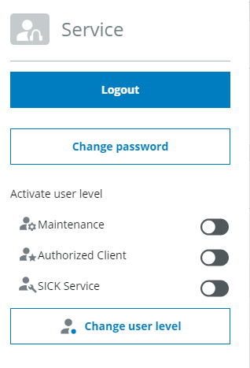
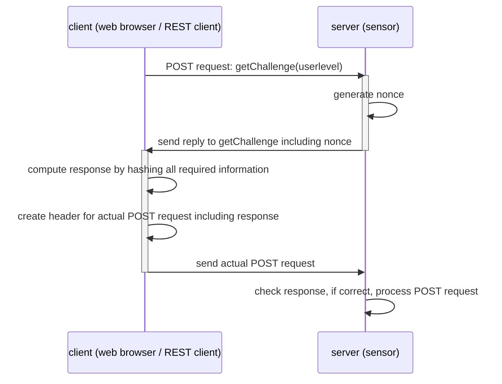
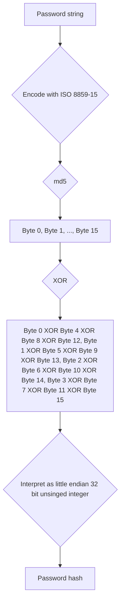

# SICK Scan REST Client

The SICK Scan REST Client shows how to read and write variables and how to call methods via the REST interface of the sensor. Variables are read using GET requests. To write variables and to call methods POST requests are required which can be challenging as the device uses a challenge-response authentication method.

The scripts are not intended to be used in productive code.

- [User levels](#user-levels)
- [Challenge-response authentication method](#challenge-response-authentication-method)
  - [Installation](#installation)
  - [Examples](#examples)
  - [Password Hashing](#password-hashing)
- [Dependencies](#dependencies)

## User levels

The sensor works with different user levels (Maintenance, Authorized Client and Service). By default only user level Service is enabled. If communication via other user levels is desired, they need to be enabled first, e.g. via the GUI.



## Challenge-response authentication method

For sending POST requests to the sensor challenge-response authentication is required. The challenge-response authentication is a security mechanism that involves the exchange of a challenge and a response between a client and a server. The server (sensor) sends a challenge to the client, which the client must respond to with a valid response. The different steps which are required to execute a POST request to write a variable or to call a method are (the code snippets below correspond directly to the variable names in the code):

1. The client calls the method `getChallenge` of the sensor with a POST request. (No authentication is required for this POST request to call that method.) As payload the username for the actual POST request (which requires authentication) is sent.
2. In the method `getChallenge` the sensor generates a random number called *nonce*.
3. The sensor sends the reply to the `getChallenge` request which contains (among other fields) also the *nonce* (`challenge['nonce']`)
4. The client combines the *nonce* with the username, the password for that username and also the method or variable name for the actual POST request and encrypts all that information using the SHA256 hash function. Some sensors also send a *salt* (contained in `challenge['salt']`) which is a random number that is appended to the password before it is put in the hash function to make it more difficult for a potential attacker to recover the password from the hash value.
5. The client generates a request header which contains the response computed in the previous step (`header['response']`) as well as the desired username (`header['user']`) and the fields *nonce*, *opaque* and *realm* from the challenge.
6. This header (field `request_dict['header']`) is now used in the actual POST request which is sent from the client to the sensor. The payload of the request (field `request_dict['data']`) contains the name of the method to be called or the variable to be written as well as the parameters.

> **NOTE:** The nonce, i.e. random number which is sent from the sensor to the client, changes for every request to prevent a potential attacker to use it to find out the secret password. That means that for each POST request the challenge has to be computed again as described above.

The sequence diagram below shows the information exchange between the client and the sensor.


```mermaid
sequenceDiagram
    participant client as client (web browser / REST client)
    participant sensor as server (sensor)
    client->>sensor : POST request: getChallenge(userlevel)
    activate sensor
    sensor->>sensor: generate nonce
    sensor->>client: send reply to getChallenge including nonce
    deactivate sensor
    activate client
    client->>client: compute response by hashing all required information
    client->>client: create header for actual POST request including response
    client->>sensor: send actual POST request
    deactivate client
    sensor->>sensor: check response, if correct, process POST request
```

Some sensors have a rate limiting on REST endpoints. That means that the sensor does not respond to further requests if there are too many requests in a certain time period, until some time has passed. If you encounter this, slow down the rate at which you access REST endpoints of the sensor.

### Installation

Poetry is required to install the SICK Scan REST Client. See [Poetry Documentation](https://python-poetry.org/docs/) for installation instructions. With poetry installed simple type ```poetry install``` in the directory where the ```pyproject.toml``` file is located. Now the package can be used from the created virtual environment.

### Examples

- See ```examples/sick_scan_rest_client_example.py``` for a usage example. Run the example with ```poetry run python .\examples\sick_scan_rest_client_example.py```
- See ```examples/set_rest_password.py``` for an example of how to change the REST password. Run the example with ```poetry run python .\examples\set_rest_password.py```
- See ```examples/set_cola_ab_password.py``` for an example of how to change the Cola A/B password. Run the example with ```poetry run python .\examples\set_cola_ab_password.py```

A list with available variables and methods which can be addressed via the REST interface can be found as OpenAPI description here:

- [picoScan150 OpenAPI Description](https://www.sick.com/de/en/downloads/media/swp678507)
- [picoScan120 OpenAPI Description](https://www.sick.com/de/en/downloads/media/swp684461)
- [multiScan100 OpenAPI Description](https://www.sick.com/de/en/downloads/media/swp678669)
- [LRS4000 OpenAPI Description](https://www.sick.com/de/en/downloads/media/swp1640199)

### Password Hashing

#### CoLa A/B

CoLa A/B is SICKs legacy protocol. It is recommended to use the [REST](#rest) interface. The password hash for CoLa A/B is computed as follows: First the password string is encoded using ISO 8859-15 and then the MD5 algorithm is applied. This results in 16 bytes. The bytes are grouped into four groups of four bytes each. Each group is XORed to a single byte. The resulting four bytes are concatenated to a 32 bit integer. To change the password of the current user level via CoLa A/B the hash for the new password must be computed as described. Then it is sent to the device with the method SetPassword. An example implementation of this algorithm can be found in `examples/set_cola_ab_password.py`.


```mermaid
flowchart TD
    pw[Password string]
    encoding{Encode with ISO 8859-15}
    md5{md5}
    digest["Byte 0, Byte 1,  ..., Byte 15"]
    xor{XOR}
    xoredDigest["Byte 0 XOR Byte 4 XOR Byte 8 XOR Byte 12, Byte 1 XOR Byte 5 XOR Byte 9 XOR Byte 13, Byte 2 XOR Byte 6 XOR Byte 10 XOR Byte 14, Byte 3 XOR Byte 7 XOR Byte 11 XOR Byte 15"]
    asInt{Interpret as little endian 32 bit unsinged integer}
    hash[Password hash]
    pw --> encoding
    encoding --> md5
    md5 --> digest
    digest --> xor
    xor --> xoredDigest
    xoredDigest --> asInt
    asInt --> hash
```

#### REST

The password hashing algorithm to change the REST password is depicted below. For clarity some details like encoding are omitted. You can read the `__change_password` method of the RESTClient to get the full picture. An example of how to use this algorithm can be found in `examples/set_rest_password.py`.

The algorithm generates the message that needs to be transmitted to the device by combining cryptographic primitives in four steps.
First, the invoker password is hashed together with the invoking user level, the invoker password, and the salt provided by the sensor. The salt for this operation needs to be queried beforehand from the device by accessing the `getChallenge` endpoint. Second, the target password is hashed together with the target user level, the new target password, and a newly generated salt. Third, the hash of the new password and the newly generated salt are symmetrically encrypted using the old password hash. Fourth, a hash-based message authentication code (HMAC) is calculated. The final message is the input message concatenated with the HMAC and the result of the HMAC. The user then has so solve the challenge which was queried from the device at the beginning and send the final message to the `changePassword` endpoint. The first two steps ensure that the password is not transmitted in clear text. Salting the passwords prevents rainbow table attacks because even if a commonly used password is chosen, the hash cannot be found in a rainbow table if the salt is appended to the password. The random numbers that are required in the algorithm should be generated with a random number generator intended for cryptographic purposes.

The symmetric encryption in the third step ensures that only participants with knowledge of the old password hash can decode the salt and the hash of the new password. The new salt is stored on the sensor to be returned for every new 'getChallenge' request for the target user level. The result of the fourth step is transmitted to the sensor. Thus an attacker might listen to or modify the message. However, the attacker cannot read the plain text of the message, because it was symmetrically encoded. Additionally, the HMAC prevents a malicious actor from tampering with the message without being noticed by the sensor. The sensor must ensure that the input of the HMAC and the result of the HMAC match. This is sufficient because the HMAC uses the old password as the key. Thus the old password is required to generate a valid HMAC for a certain input.

```mermaid
flowchart TD
    subgraph "Step 1: Hash invoker password"
        inv_user_lvl["Invoker user level"]
        inv_pw["Invoker password"]
        device_salt["Salt retrieved from device"]
        sha256{SHA256}
        inv_user_lvl --> sha256
        inv_pw --> sha256
        device_salt --> sha256
    end

    subgraph "Step 2: Hash new password"
        client_salt[128 random bits]
        target_lvl["Target user level"]
        target_new_pw["Target user new password"]
        sha2562{SHA256}
        target_lvl --> sha2562
        target_new_pw --> sha2562
        client_salt --> sha2562
    end

    subgraph "Step 3: Symmetric Encryption"
        take16{Take the first 16 bytes}
        sha256 --> take16
        iv[128 random bits]
        concat5{Concatenate}
        sha2562 --> concat5
        client_salt --> concat5
        aes128{AES128 CBC}
        concat5 -->|Data| aes128
        take16 -->|Key| aes128
        iv -->|Initialization| aes128
    end

    subgraph "Step 4: HMAC"
        hmac{"HMAC (SHA256)"}
        sha256 -->|Key| hmac
        concat{Concatenate}
        iv --> concat
        aes128 --> concat
        concat -->|Message| hmac
        concat2{Concatenate}
        concat --> concat2
        hmac --> concat2
    end

    res["Result"]
    concat2 --> res
 ```

## Dependencies

This module relies on the following dependencies which are downloaded during the build process.

| Name               | Version    | License-Classifier                   | URL                                                                                                                  |
|--------------------|------------|--------------------------------------|----------------------------------------------------------------------------------------------------------------------|
| certifi            | 2024.12.14 | Mozilla Public License 2.0 (MPL 2.0) | [https://github.com/certifi/python-certifi](https://github.com/certifi/python-certifi)                               |
| charset-normalizer | 3.4.0      | MIT License                          | [https://github.com/Ousret/charset_normalizer](https://github.com/Ousret/charset_normalizer)                         |
| idna               | 3.10       | BSD License                          | [https://github.com/kjd/idna](https://github.com/kjd/idna)                                                           |
| pycryptodome       | 3.21.0     | BSD License; Public Domain           | [https://www.pycryptodome.org](https://www.pycryptodome.org)                                                         |
| requests           | 2.31.0     | Apache Software License              | [https://requests.readthedocs.io](https://requests.readthedocs.io)                                                   |
| urllib3            | 2.0.7      | MIT License                          | [https://github.com/urllib3/urllib3/blob/main/CHANGES.rst](https://github.com/urllib3/urllib3/blob/main/CHANGES.rst) |
